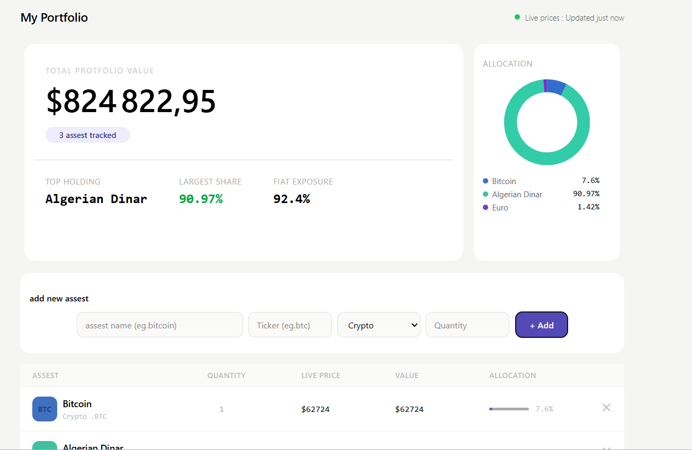
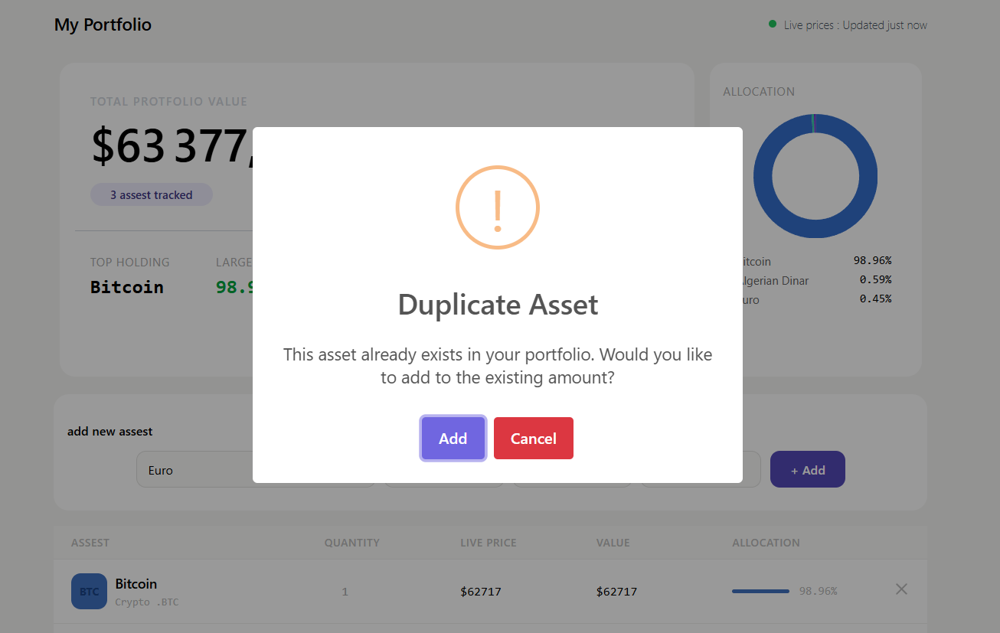
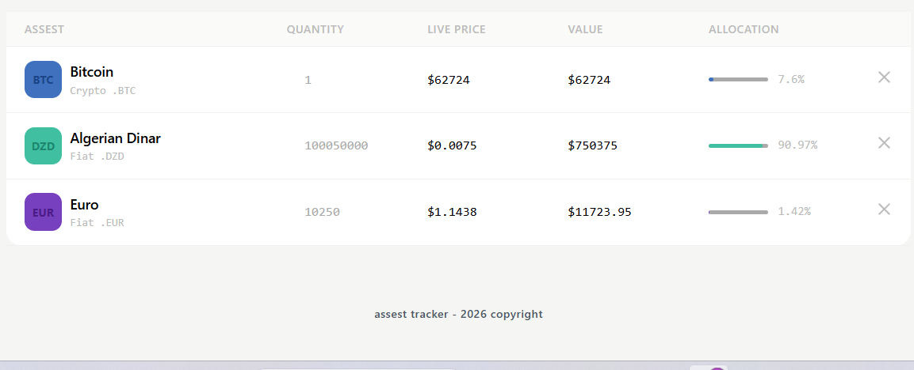
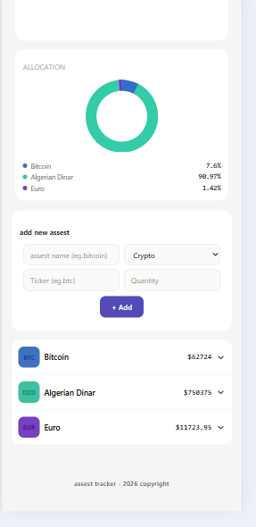

# Asset Tracker

A vanilla JavaScript portfolio tracker for monitoring crypto and fiat currency holdings in one place — live prices, allocation breakdown, and portfolio value, all without a single framework.

**Live demo:** [https://assest-tracker-seven.vercel.app/](https://assest-tracker-seven.vercel.app/)

## Features

- **Add crypto or fiat assets** with live autocomplete search for both asset name and ticker
- **Duplicate asset detection** — adding an existing holding prompts a confirmation to merge amounts instead of creating duplicate entries
- **Live price fetching** via CoinGecko (crypto) and open.er-api.com (fiat), with client-side caching to avoid redundant API calls
- **Portfolio summary** — total value, top holding, largest share, and fiat exposure at a glance
- **Interactive donut chart** (Chart.js) showing allocation by asset
- **Responsive design** — full data table on desktop, expandable tap-to-view cards on mobile
- **Delete assets** directly from the table or mobile card view
- **Persistent storage** via `localStorage` — no backend required

## Screenshots

**Dashboard**


**Duplicate asset confirmation**


**Asset table**


**Mobile view**


## Tech Stack

- **Vanilla JavaScript** (ES6+) — no frameworks
- **Tailwind CSS v4** — styling
- **Chart.js** — donut chart visualization
- **SweetAlert2** — alerts and confirmation dialogs
- **CoinGecko API** — crypto search and pricing
- **open.er-api.com** — fiat exchange rates
- **localStorage** — data persistence and price caching

## Setup

Clone the repo and install the Tailwind CLI to compile styles locally.

```bash
git clone https://github.com/ilyesmezghiche1/Asset-Tracker.git
cd Asset-Tracker
npm install
```

Run the Tailwind watcher to compile `output.css` from `src/input.css`:

```bash
npx @tailwindcss/cli -i ./src/input.css -o ./output.css --watch
```

Then open `index.html` with a live server (e.g. VS Code's Live Server extension) to view the app locally.

## Challenges & Learnings

**Asset search data** — No API returns both name and price together for autocomplete, so I hardcoded a static fiat currency list (a fixed, rarely-changing set) and used CoinGecko's search + pricing endpoints separately for crypto.

**OOP vs. procedural code** — Wrote mostly procedural JS instead of classes, even where OOP would reduce repetition. Intentional: the goal here was mastering fundamentals, not architecture. Production code would look different.

**API rate limits & caching** — The crypto price API has a limited quota, and I was initially fetching the same prices twice per render, burning through it fast. Fixed by caching prices in `localStorage` with a timestamp, only re-fetching once a staleness window passes.

**Duplicate assets** — Adding an existing holding used to create a duplicate row instead of updating it. Fixed with `Array.find()` to detect a match and merge amounts, plus a SweetAlert2 confirmation so the user decides whether to merge.

**Responsive retrofit** — The UI was built desktop-first with fixed pixel widths, which broke on mobile because layout-direction and width breakpoints didn't line up. Lesson: design mobile-first next time, add fixed widths only where a breakpoint actually needs them.

**Dynamic event handling** — Table rows and cards are fully re-rendered on every update, so per-row listeners wouldn't stick. Used event delegation (one listener on the parent, `.closest()` to find the clicked element) instead.

## Author

Built by Ilyes Mezghiche as part of a self-taught frontend development learning path.

---

*Asset Tracker — 2026*
